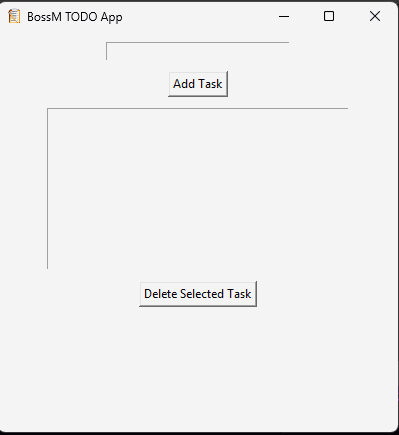

<h1 align="center">📝 BossM TODO GUI App</h1>

<p align="center">
  
  
  
</p>

<p align="center">
  A simple, clean and fully working desktop TODO app built with <strong>Python</strong> and <strong>tkinter</strong>. <br>
  🖥️ Easy to use GUI • 💾 Saves tasks to file • 🧊 Includes EXE build and custom icon
</p>

---

## 📸 Preview



---

## 🚀 Features

- ✅ Add and delete tasks
- 💾 Auto-saves to `todo.json`
- 🧠 Built with Python `tkinter`
- 🧊 Custom icon (`bossm.ico`)
- 📦 Bundled `.exe` with PyInstaller

---

## 🛠 Technologies Used

| Category        | Tech Stack     |
|----------------|----------------|
| 👨‍💻 Language     | Python 3.x     |
| 🖼 GUI Framework | Tkinter        |
| 📁 Packaging    | PyInstaller    |
| 🎨 Icon Format  | `.ico` (64x64, 256x256) |

---

## 🧪 How to Run

### 🖥️ Option 1: Run from Source

```bash
git clone https://github.com/Mark31-dev/BossMDev-todo-gui.git
cd BossMDev-todo-gui
python todo_gui.py
```

Requirements:
- Python 3.x installed
- `todo_gui.py`, `todo.json`, and `bossm.ico` in the same folder

---

### 🧊 Option 2: Run as .EXE (No Python Needed)

1. Go to the [Releases](https://github.com/Mark31-dev/BossMDev-todo-gui/releases) section.
2. Download the `dist/todo.exe` file.
3. Double-click to run.

---

## 🏗 How to Build the .exe Yourself

Install PyInstaller:

```bash
pip install pyinstaller
```

Then build with:

```bash
pyinstaller --onefile --icon=bossm.ico todo_gui.py
```

---

## 👤 Author

- **BossM** — [markherrero.dev@gmail.com](mailto:markherrero.dev@gmail.com)

---

## 📄 License

This project is licensed under the [MIT License](LICENSE).
